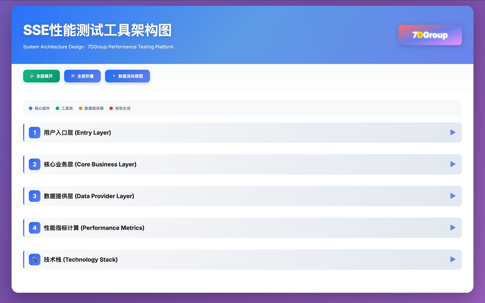

# 7DGroup SSE Streaming Output Performance Testing Tool

**Author: 7DGroup**

🇨🇳 [中文版本](README.md) | 🇬🇧 English Version

This is a professional-grade SSE (Server-Sent Events) streaming output performance testing and stress testing tool developed by the 7DGroup team, specifically designed for AI large model streaming response scenarios. Built with Python3, this tool provides a complete performance testing solution capable of comprehensively evaluating the response speed, throughput, stability, and concurrent processing capabilities of streaming AI services.

## Architecture Diagram


**Core Capabilities**:
- **Streaming Performance Testing**: Precisely measures key performance metrics of SSE streaming output, including Time To First Token (TTFT), Time Per Output Token (TPOT), Time To First Byte (TTFB), throughput (tokens/s), etc., helping developers deeply understand the response characteristics of AI services.
- **High-Concurrency Stress Testing**: Supports multi-threaded concurrent testing, capable of simulating scenarios with a large number of simultaneous users. By configuring parameters such as thread count, execution duration, and Ramp-up, you can flexibly control testing intensity and patterns to comprehensively evaluate system performance under high load.
- **Parameterized Testing**: Supports query text parameterization and API Key parameterization, allowing batch reading of test data from files to implement diverse testing scenarios, particularly suitable for performance evaluation in complex scenarios such as multi-tenant, multi-model, and load balancing.
- **Real-time Monitoring Statistics**: Automatically enables real-time summary statistics during multi-threaded testing, outputting system-level performance metrics every second including active thread count, cumulative data blocks, average response time, TPOT, Tokens/s, success rate, etc., making the testing process visualizable and monitorable.
- **Professional Report Generation**: Automatically generates beautiful HTML performance test reports containing 12+ key metric trend charts, system-level performance metric analysis, detailed statistical tables (mean, min, max, P90, P95, P99 percentiles), supporting interactive chart zooming and dragging with synchronized zooming across all charts for in-depth performance data analysis.
- **Smart Retry Mechanism**: Built-in HTTP retry mechanism automatically handles network exceptions and server errors (429, 500, 502, 503, 504 status codes), with up to 3 retries using exponential backoff strategy to improve testing reliability and stability.
- **Flexible Execution Modes**: Supports both single execution and continuous execution modes. You can specify test execution duration and combine with Ramp-up functionality to achieve progressive stress testing, simulating real user access patterns for comprehensive evaluation of system performance and stability.
- **Thread-Safe Design**: Adopts thread lock mechanisms to ensure data safety in multi-threaded environments. Parameterized providers support thread-safe cyclic reading, ensuring data consistency and testing accuracy in high-concurrency scenarios.

**Application Scenarios**:
- Performance evaluation and optimization of AI large model services
- Response speed testing for streaming APIs
- System capacity planning and load assessment
- Performance comparison in multi-tenant, multi-model scenarios
- Production environment performance monitoring and benchmarking
- Automated performance testing in CI/CD workflows

## Features

- ✅ SSE Support
- ✅ Calculate key performance metrics:
  - **TTFT** (Time To First Token): Time to first token
  - **TPOT** (Time Per Output Token): Time per output token
  - **TTFB** (Time To First Byte): Time to first byte
  - **Throughput**: tokens/second
- ✅ Statistics:
  - Data block count
  - Token count
  - Complete response length
  - Conversation ID and message ID
- ✅ **HTML Performance Report**:
  - Automatically generates beautiful HTML reports (default output to `report/` directory with timestamp in filename)
  - Contains 12+ key metric trend charts (TTFT, TPOT, TTFB, throughput, response time, token count, RPS, thread count, etc.)
  - System-level performance metric trend charts (system total throughput, system average response time, system average TPOT, total request count)
  - Detailed statistical tables (mean, min, max, P90, P95, P99)
  - Interactive charts support zooming and dragging (all charts synchronized)
  - 7DGroup brand identity
- ✅ **Real-time Summary Statistics**:
  - Automatically outputs real-time summary statistics every second during multi-threaded testing
  - Displays active thread count, data blocks, average response time, TPOT, Tokens/s, success rate, etc.
- ✅ **HTTP Retry Mechanism**:
  - Automatically retries failed requests (429, 500, 502, 503, 504 status codes)
  - Up to 3 retries with exponential backoff strategy

## Project Structure

```
AI-7D-SATS-SSEPerfTestToolCli/
├── src/sse_perf_tool/        # Source code directory
│   ├── __init__.py           # Package initialization file
│   ├── providers.py          # Parameter providers (queries and API Keys)
│   ├── tester.py             # SSE tester core logic
│   ├── test_runner.py        # Test runner and statistics aggregation
│   └── report_generator.py    # HTML report generator
├── docs/                   # Documentation directory
│   ├── 指标计算方法.md     # Performance metric calculation guide
│   ├── 请求体模板使用指南.md # Request body template usage guide
│   ├── CLAUDE.md          # Claude Code assistant guide
│   └── AGENTS.md         # AI Agent development guide
├── examples/               # Examples directory
│   ├── request_body_template_default.json   # Default request body template
│   ├── request_body_template_example.json  # OpenAI-style request body template
│   └── queries_example.txt  # Query example file
├── assets/                 # Assets directory
│   ├── 2026-01-15-21-47-26.png # Architecture diagram
│   └── 架构图.html            # Interactive architecture diagram
├── .github/                # GitHub related configuration
│   ├── workflows/          # GitHub Actions workflows
│   └── ISSUE_TEMPLATE/     # Issue templates
├── tests/                 # Test directory (to be added)
├── openspec/              # OpenSpec specification
├── .gitignore            # Git ignore file configuration
├── LICENSE               # License
├── README.md             # Project documentation (Chinese)
├── README_EN.md          # Project documentation (English)
├── CONTRIBUTING.md       # Contributing guide
├── PROJECT_STRUCTURE.md  # Project structure detailed description
├── requirements.txt      # Python dependency list
└── sse_perfTestTool.py  # Main entry file
```

## Install Dependencies

```bash
pip3 install -r requirements.txt
```

## Usage

### Basic Usage

```bash
# API Key can be in 'app-xxx' or 'Bearer app-xxx' format
python3 sse_perfTestTool.py --host localhost --port 80 --api-key "app-xxx"

# Or use complete Bearer token format
python3 sse_perfTestTool.py --host localhost --port 80 --api-key "Bearer app-xxx"
```

### Testing Different API Endpoints

By default, the tool tests the `/v1/chat-messages` endpoint. If you want to test other API endpoints, you can use the `--api-path` parameter:

```bash
# Test default endpoint (/v1/chat-messages)
python3 sse_perfTestTool.py --host localhost --port 80 --api-key "app-xxx"

# Test other endpoints, e.g., OpenAI-style endpoint
python3 sse_perfTestTool.py --host localhost --port 80 --api-key "app-xxx" --api-path "/v1/chat/completions"

# Test custom endpoint
python3 sse_perfTestTool.py --host localhost --port 80 --api-key "app-xxx" --api-path "/api/v1/stream"

# Test other path endpoints
python3 sse_perfTestTool.py --host localhost --port 80 --api-key "app-xxx" --api-path "/stream/chat"
```

**Note**:
- The `--api-path` parameter specifies the path part of the API, without including protocol, host, and port
- Path should start with `/`, e.g., `/v1/chat-messages`, `/api/stream`, etc.
- Different API endpoints may have different request body formats. You can use the `--request-body-file` parameter to specify a custom request body template

### Custom Request Body Format

Different API endpoints typically require different request body formats. The tool supports customizing request body formats via JSON template files:

```bash
# Use custom request body template
python3 sse_perfTestTool.py --host localhost --port 80 --api-key "app-xxx" \
  --api-path "/v1/chat/completions" \
  --request-body-file examples/request_body_template_example.json
```

**Request Body Template File Format**:

The template file is a JSON file that supports the following variable substitutions:
- `{query}` - Replaced with query text
- `{conversation_id}` - Replaced with conversation ID
- `{user}` - Replaced with user identifier
- `{inputs.key}` - Replaced with the value corresponding to the key in the inputs dictionary (if inputs are provided)
- `{files}` - Replaced with file list (if files are provided)

**Example Template Files**:

1. **OpenAI-style endpoint** (`examples/request_body_template_example.json`):
```json
{
  "model": "gpt-4",
  "messages": [
    {
      "role": "user",
      "content": "{query}"
    }
  ],
  "stream": true,
  "temperature": 0.7,
  "user": "{user}"
}
```

2. **Default format** (`examples/request_body_template_default.json`):
```json
{
  "inputs": {
    "query": "{query}"
  },
  "query": "{query}",
  "response_mode": "streaming",
  "conversation_id": "{conversation_id}",
  "user": "{user}",
  "files": []
}
```

**Usage Notes**:
- If `--request-body-file` is not specified, the tool will use the default request body format (suitable for `/v1/chat-messages`)
- If a template file is specified but loading fails, the tool will fall back to the default format and display a warning
- Template files must be valid JSON format
- Variable substitution is recursive and supports nested JSON structures

### Custom Query

```bash
python3 sse_perfTestTool.py --host localhost --port 80 --api-key "app-xxx" --query "Hello, please introduce yourself"
```

### Complete Parameter Example

```bash
python3 sse_perfTestTool.py \
  --host localhost \
  --port 80 \
  --api-key "app-1FOPPwMZseqz8rXLjs3G4Knu" \
  --query "Who are you" \
  --conversation-id "" \
  --user "gaolou" \
  --timeout 60
```

### Multi-threaded Testing

```bash
# Test with 2 concurrent threads
python3 sse_perfTestTool.py --host localhost --port 80 --api-key "app-xxx" --threads 2

python3 sse_perfTestTool.py --host localhost --port 80 --api-key "app-1FOPPwMZseqz8rXLjs3G4Knu" --threads 2

# Test with 5 concurrent threads
python3 sse_perfTestTool.py --host localhost --port 80 --api-key "app-xxx" --threads 5
```

### Using Parameterized Files

A parameterized file is a text file with one query text per line. The script will cyclically use the queries from the file.

```bash
# Create parameterized file queries.txt, one query per line
echo -e "Who are you\nIntroduce yourself\nWhat is artificial intelligence" > queries.txt

# Test using parameterized file
python3 sse_perfTestTool.py --host localhost --port 80 --api-key "app-xxx" --param-file queries.txt

# Multi-threaded + parameterized file (each thread will cyclically use queries from the file)
python3 sse_perfTestTool.py --host localhost --port 80 --api-key "app-xxx" --param-file queries.txt --threads 3
```

**Parameterized File Format**:
- One query text per line
- Empty lines are automatically skipped
- Supports UTF-8 encoded Chinese and English
- Example file: `examples/queries_example.txt`

### Using API Key Parameterized File

Supports reading multiple API Keys from a file, where each thread will cyclically use the API Keys from the file. This is useful for testing the performance of different API Keys or load balancing scenarios.

```bash
# Create API Key file apiKeys.txt, one API Key per line
echo -e "app-key1\napp-key2\nBearer app-key3" > apiKeys.txt

# Test using API Key parameterized file
python3 sse_perfTestTool.py --host localhost --port 80 --api-key-file apiKeys.txt --threads 5

# If API Key file reading fails, it will fall back to the default Key specified by --api-key parameter
python3 sse_perfTestTool.py --host localhost --port 80 --api-key "app-default" --api-key-file apiKeys.txt
```

**API Key File Format**:
- One API Key per line (can be in `app-xxx` or `Bearer app-xxx` format)
- Empty lines are automatically skipped
- Supports UTF-8 encoding

### Silent Mode (Output Statistics Only)

```bash
python3 sse_perfTestTool.py --host localhost --port 80 --api-key "app-xxx" --quiet
```

### Specifying Execution Duration

By default, each thread exits after executing one request. Use the `--duration` or `--execution-time` parameter to specify the test execution duration, during which each thread will continuously send requests in a loop.

```bash
# Run continuously for 60 seconds (each thread sends requests in a loop within 60 seconds)
python3 sse_perfTestTool.py --host localhost --port 80 --api-key "app-xxx" --threads 5 --duration 60

# Use --execution-time alias (equivalent to --duration)
python3 sse_perfTestTool.py --host localhost --port 80 --api-key "app-xxx" --threads 5 --execution-time 120

# Run continuously for 5 minutes (300 seconds)
python3 sse_perfTestTool.py --host localhost --port 80 --api-key "app-xxx" --threads 10 --duration 300

# Combine with ramp-up (10 threads, gradually start within 10 seconds, then run continuously for 60 seconds)
python3 sse_perfTestTool.py --host localhost --port 80 --api-key "app-xxx" --threads 10 --ramp-up 10 --duration 60
```

**Execution Mode Description**:
- **Single Execution Mode** (`--duration 0` or not specified): Each thread exits after executing one request
- **Continuous Execution Mode** (`--duration > 0`): Within the specified time duration, each thread continuously sends requests in a loop until the time is reached

### Generating HTML Performance Reports

```bash
# Basic test and generate report (specify file path)
python3 sse_perfTestTool.py --host localhost --port 80 --api-key "app-xxx" --html-report report.html

# Multi-threaded test and generate report (specify file path)
python3 sse_perfTestTool.py --host localhost --port 80 --api-key "app-xxx" --threads 5 --html-report report.html

# Continuous test and generate report (specify file path)
python3 sse_perfTestTool.py --host localhost --port 80 --api-key "app-xxx" --threads 10 --duration 60 --html-report report.html

# Do not specify --html-report, automatically generate to report/ directory (filename with timestamp)
python3 sse_perfTestTool.py --host localhost --port 80 --api-key "app-xxx" --threads 5
# Report will be automatically saved as: report/report_20260105_123456.html

# Specify model name (will be included in report filename)
python3 sse_perfTestTool.py --host localhost --port 80 --api-key "app-xxx" --model-name "gpt-4" --threads 5
# Report will be automatically saved as: report/report_gpt-4_20260105_123456.html
```

**HTML Report Features**:
- 📊 Contains 12+ key metric trend charts:
  - Request-level metrics: TTFT, TPOT, TTFB, throughput, response time, token count
  - System-level metrics: RPS (requests per second), active thread count, system total throughput, system average response time, system average TPOT, total request count
- 📈 Interactive charts drawn with Chart.js, supporting:
  - Drag to select area for zooming (all charts synchronized)
  - Double-click any chart to restore original view
  - Mouse hover to display detailed values
- 📋 Detailed statistical tables (mean, min, max, P90, P95, P99)
- 🎨 Modern UI design with 7DGroup brand identity
- 📱 Responsive design supporting different screen sizes
- 🔄 Automatically generated to `report/` directory (if path not specified), filename includes timestamp and model name

**Report File Location**:
- If `--html-report` is specified, the report is saved to the specified path
- If not specified, the report is automatically saved to the `report/` directory with filename format: `report_[model_name_]YYYYMMDD_HHMMSS.html`
- Report files can be opened directly in a browser for viewing

## Parameter Description

| Parameter | Description | Default | Required |
|-----------|-------------|---------|----------|
| `--host` | Server host address | localhost | No |
| `--port` | Server port | 80 | No |
| `--api-key` | API key (supports `app-xxx` or `Bearer app-xxx` format) | - | **Yes** (if not using `--api-key-file`) |
| `--api-path` | API path (endpoint path) | "/v1/chat-messages" | No |
| `--request-body-file` | Request body template file path (JSON format), supports variable substitution | None | No |
| `--query` | Query text | "你是谁" | No |
| `--conversation-id` | Conversation ID | "" | No |
| `--user` | User identifier | "gaolou" | No |
| `--timeout` | Request timeout (seconds) | 60 | No |
| `--threads` | Concurrent thread count | 1 | No |
| `--param-file` | Parameterized file path (one query per line) | None | No |
| `--api-key-file` | API Key parameterized file path (one API Key per line) | None | No |
| `--ramp-up` | Stress test thread ramp-up time (seconds) | 0 | No |
| `--duration` / `--execution-time` | Test execution duration (seconds), >0 means continuously send requests within the specified time window, 0 means execute only once | 0 | No |
| `--html-report` | Generate HTML report file path. If not specified, defaults to `report/` directory with auto-generated timestamp in filename | None | No |
| `--model-name` | Model name (optional), if provided will be included in report filename | None | No |
| `--quiet` | Silent mode, no detailed output and real-time summary statistics | False | No |

## Output Examples

### Single-threaded Test Output

```
============================================================
Starting streaming request...
URL: http://localhost:80/v1/chat-messages
Query: 你是谁
============================================================
Response code: 200
Starting to receive streaming response...
------------------------------------------------------------
[Time Statistics] Time To First Byte (TTFB): 245.32 ms
[Key Metrics] Time To First Token (TTFT): 250.15 ms

----------------------------------------------------------------------------------------------------
        Data Blocks   Avg Response Time(ms)   TPOT(ms/token)            Tokens/s
----------------------------------------------------------------------------------------------------
           105                 27.82                 12.48                 80.46
           106                 27.56                 12.33                 81.46
...
----------------------------------------------------------------------------------------------------
============================================================
           Streaming Response Completed - Statistics
============================================================
Conversation ID: abc123-def456-ghi789
Message ID: msg-123456
Total Data Blocks: 25
Token Count: 45
Complete Response Length: 120 characters
------------------------------------------------------------
[Time Statistics]
  Connection Time: 5.23 ms
  Time To First Byte (TTFB): 245.32 ms
  Streaming Duration: 1250.45 ms
  Total Response Time: 1495.78 ms
------------------------------------------------------------
[Key Metrics]
  Time To First Token (TTFT): 250.15 ms
  Time Per Output Token (TPOT): 28.45 ms/token
  Throughput: 35.15 tokens/second
============================================================
```

### Multi-threaded Test Output

```
Loaded parameterized file: queries.txt
Query count: 10

Starting test, thread count: 3
Execution mode: Single execution (each thread exits after one execution)
============================================================

--------------------------------------------------------------------------------------------------------------------------------------------
Time       Threads(Active/Total)  Data Blocks  Avg Response Time(ms)  TPOT(ms/token)  Tokens/s        Success Rate(%)
--------------------------------------------------------------------------------------------------------------------------------------------
10:30:15   3/3                    15           1250.50                28.45           35.15           100.00
10:30:16   3/3                    30           1250.50                28.45           35.15           100.00
10:30:17   3/3                    45           1250.50                28.45           35.15           100.00
...

============================================================
           Test Completed - Summary Statistics
============================================================
Configured Thread Count: 3
Request Count: 3
Actual Execution Time: 2.50 seconds
Success: 3
Failure: 0
Success Rate: 100.00 %
Total Data Blocks: 75
Total Tokens: 135
Total Response Time: 4487.34 ms
Average Response Time: 1495.78 ms
Average TTFB: 245.32 ms
Average TTFT: 250.15 ms
============================================================

✓ HTML report generated: /path/to/report/report_20260105_103017.html
```

**Real-time Summary Statistics Description**:
- During multi-threaded testing, real-time summary statistics are automatically output every second
- Displays current time, active thread count, cumulative data blocks, average response time, TPOT, Tokens/s, success rate, etc.
- Use the `--quiet` parameter to disable real-time summary statistics output

## Key Metrics Description

### TTFT (Time To First Token)
The time from request start to receiving the first token containing the answer. This is an important metric for measuring response speed.

### TPOT (Time Per Output Token)
The average time per output token, calculated as:
```
TPOT = (last token time - first token time) / (token count - 1)
Unit: milliseconds/token (ms/token)
```

**Note**: Using `(token count - 1)` because we calculate the number of intervals between tokens. For example, if there are 3 tokens, there are 2 intervals.

### Tokens/s (Tokens per second)
The number of tokens output per second, calculated as:
```
Tokens/s = token count / (total time / 1000)
        = (token count * 1000) / total time (milliseconds)
Unit: tokens/second
```

## License

This project is licensed under the GNU General Public License v3.0. See the [LICENSE](LICENSE) file for details.

For more information about GPL v3, please visit: <https://www.gnu.org/licenses/gpl-3.0.html>
